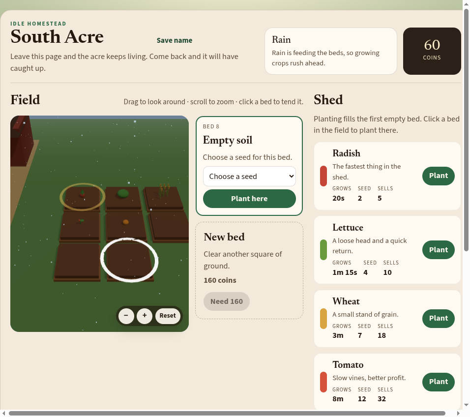
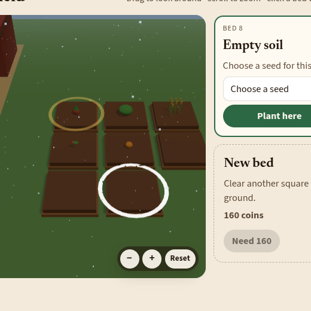
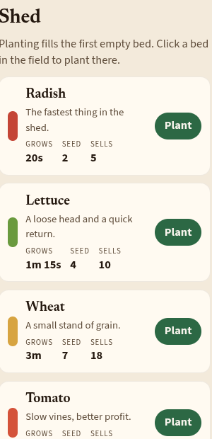
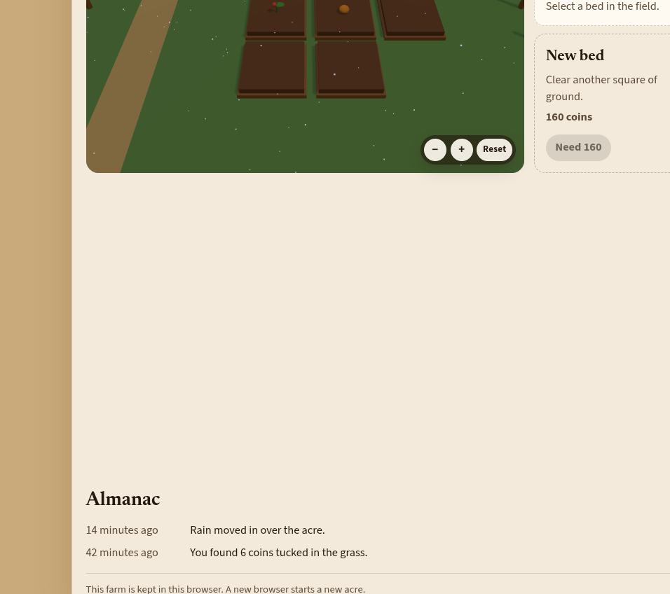

# South Acre

An idle homestead game built with Rails 8. Plant crops, leave the page, and come back to find the acre has kept living.

Each browser session gets its own farm. Crops grow in real time, weather changes the field, and a Solid Queue job advances the world while you are away.



## Screenshots

| Field & beds | Shed |
| --- | --- |
|  |  |



## Stack

- Ruby 4.0.7 / Rails 8.1
- SQLite
- Hotwire (Turbo + Stimulus)
- Three.js field view with orbit, zoom, and reset controls
- Solid Queue / Solid Cache / Solid Cable
- Kamal-ready Docker image

## Getting started

```bash
bin/setup
```

That installs gems, prepares the database, and starts the development server. Open [http://localhost:3000](http://localhost:3000).

To prepare the database without starting the server:

```bash
bin/setup --skip-server
bin/rails server
```

## Playing

- Click a bed in the 3D field to select it, then plant or harvest from the side panel.
- Drag to look around, scroll or use `+` / `−` to zoom, and **Reset** to restore the default camera.
- The shed plants the first empty bed; bed menus plant a specific plot.
- Clear ground to expand up to nine beds.
- Rain speeds growth, dry weather slows it, and leaving ripe crops too long can invite crows.
- The Almanac records weather changes, coin finds, and other world events.

## Tests

```bash
bin/rails test
bin/rubocop
```

Or the full CI suite locally:

```bash
bin/ci
```

## Container image

A GitHub Actions workflow builds and publishes the production image to GitHub Container Registry on pushes to `main`/`master`, on `v*` tags, and via workflow dispatch.

Image:

```text
ghcr.io/bookieutils-wq/south-acre
```

Common tags:

| Tag | When |
| --- | --- |
| `latest` | Default branch |
| `main` | Branch push |
| `<short-sha>` | Every build |
| `1.2.3` | Git tag `v1.2.3` |

Pull:

```bash
docker pull ghcr.io/bookieutils-wq/south-acre:latest
```

Build locally:

```bash
docker build -t south-acre .
docker run --rm -p 80:80 \
  -e RAILS_MASTER_KEY="$(cat config/master.key)" \
  --name south-acre south-acre
```

## Deploy

Kamal config lives in `config/deploy.yml`. Point the registry at GHCR when you are ready to deploy the published image:

```yaml
image: bookieutils-wq/south-acre
registry:
  server: ghcr.io
  username: bookieutils-wq
  password:
    - KAMAL_REGISTRY_PASSWORD
```

## License

Private application unless otherwise noted.
